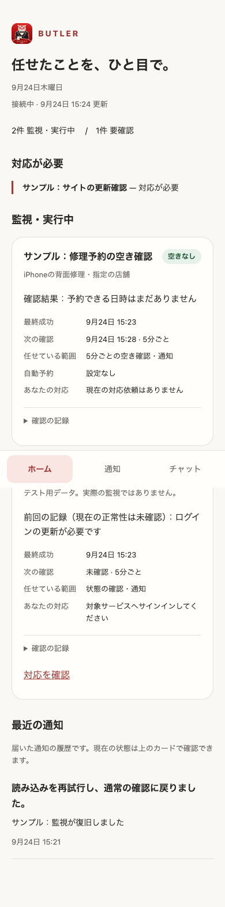
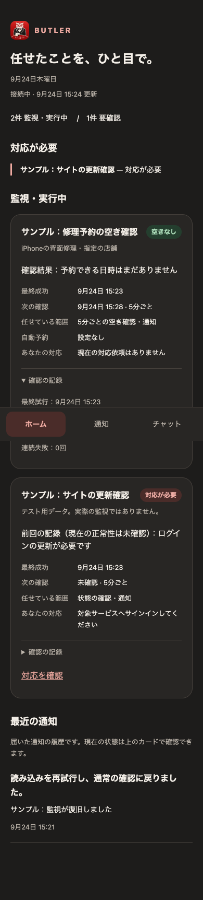

# Issue #853 — 独立レビューの検証記録

## 実装側検証
対象＋既存Workerは330件成功。全体は1310件中1309成功・1skip・失敗0。既存VPSログテストは既存環境変数でテスト領域に隔離。worker build / self-parity / generated worker検査が成功した。

## 操作担当による独立検証
2026-09-24、実WorkerのローカルHTTPサーバーとin-memory storeを使い、別のブラウザハーネスで確認した。データは全てサンプルであり、本番予約・実監視結果ではない。外部サービスへの送信なし。

- 390px mobileと1280px desktopで横スクロールなし。
- light/darkの表示を確認。
- 5秒後の鮮度再描画でもdetailsの開いた状態を保持。
- offlineで「現在の状態は未確認」と表示し、0件正常と誤認させない。
- 401で認証の必要性を表示。
- JavaScript pageerrorなし。
- 実SQLiteのD1アダプターでupsert・古い観測の拒否・100件上限を独立確認。
- 稼働中の監視stateは別途読み取りのみで照合し、PID開始時刻の識別と既存watch形式からの変換を確認。監視の操作・停止・認証情報の読み取り・状態の本番送信は行っていない。

## デモ画像
以下は合成データの画面であり、接続済みサービスや予約成立を証明しない。

## 未実施
本番デプロイ、実reporter送信、iPhoneインストール済みPWAでのトップ切り替え、生成Worker版の独立ブラウザ再検証は未実施。ソースWorkerのブラウザ検証と生成物整合テストを区別する。実運用完了とは主張しない。
