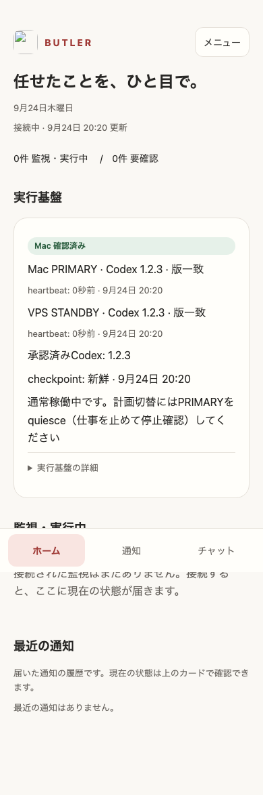
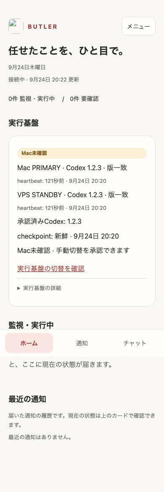
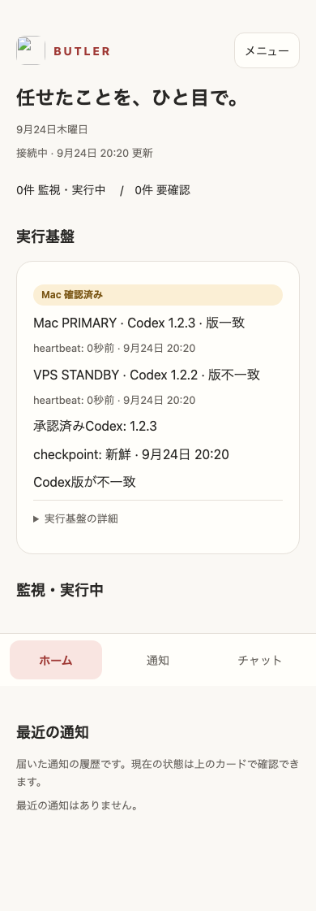

# Issue #858 — Mac PRIMARY / VPS STANDBY E2E

## ローカル検証

2026-09-24。合成データだけを使い、外部実行・package更新・service変更・production mutationなしで検証した。

- focused executor/bridge/runner tests: 289件成功・失敗0。
- 全体: 1375件中1374件成功・1skip・失敗0。
- worker build、self parity、generated worker整合: 成功。
- Chrome 390×844 light/darkで6状態×2テーマ=12ケース成功。
- 検証状態: healthy、failover-ready、version mismatch、dirty checkpoint、activation pending、uninitialized。
- Mac→VPS→Macで旧generationを拒否し、activation pending中は両側を拒否、新PRIMARYのrunning+receipt+smoke+exact versionでのみ有効化する。
- Dashboard app-server bridgeは各owner turn前、VPS runnerはqueue/preflight/write前にserverへgeneration認可を再確認する。
## 境界

このadmission fenceは共有gateway bearerを使うため、ノード本人性の暗号学的証明ではない。古いgenerationの偶発的なprocessをfail-closedにする境界である。進行中Codexのremote kill、認可直後の副作用との完全なtransaction、ローカルで直接起動された無関係processまでは保証しない。

heartbeat消失だけでは自動failoverしない。計画切替はPRIMARYのquiesceとclean/pushed checkpointが必要。emergency切替もownerのscoped passkeyが必要。merge/deploy/credential/root authorityはexecutorへ移さない。

Codex versionはMacでsmoke済みexact versionをownerが承認して初めてapproved versionになる。VPSへのinstallはこのE2Eでは実行していない。現在の実機read-only確認ではMac bundled Codex=0.153.0-alpha.5、VPS npm Codex=0.146.1で差があり、npm registryに0.153.0-alpha.5が存在することだけを確認した。個人パスやsecretはrepo evidenceへ保存しない。

## DEMO画像

以下は合成データであり、本番executor状態ではない。

